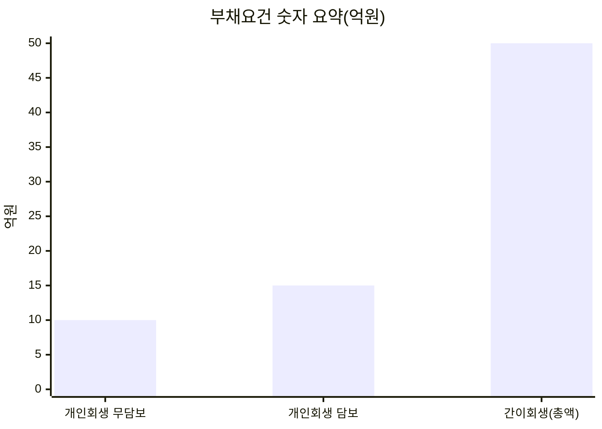

# 부채 50억 기준으로 보는 간이회생·법인회생(기업회생)·개인회생의 부채요건 구별 리서치 및 원고 패키지

## 리서치 범위와 자료 사용 원칙

이번 작업은 **GitHub 저장소 `yunsopyeong/-Lawyer-s-Field-Notes`를 먼저 검토**해, 문체·구성·검수 기준(정보 수집 → 분석 → 결론, 단정형 표현 금지, 실무 포인트 강조)을 우선 적용했습니다. 해당 저장소는 “대한민국 법령·판례·공식자료 우선”이라는 원칙과, 회생·파산 주제에서 **실무준칙 관점(자료 정리, 보정 포인트, 최근 변동 사정의 설명 부담 등)**을 함께 반영하라는 운영 기준을 제시합니다. fileciteturn10file0L1-L1 fileciteturn12file0L1-L1 fileciteturn16file0L1-L1 fileciteturn7file0L1-L1

그 다음 단계에서, **법원·법무부·국가법령정보센터(법제처)·대법원 판례/주요판결**을 우선으로 웹 리서치를 확장했고(부채요건·법조문·판례·지침 확인), 보조적으로 신뢰 가능한 해설(법원 안내, 생활법령정보, 학술논문) 및 **플랫폼 콘텐츠(네이버/브런치/유튜브용 구성 참고)**를 교차 확인했습니다. citeturn5search0turn6search0turn0search0turn8search3turn9search0turn0search7

## 부채 50억과 개인회생 10억·15억의 핵심 정리

실무에서 “부채 50억”은 **단순한 재무제표상 부채 총액**이 아니라, 법에서 정한 **“회생채권 및 회생담보권 총액”**을 기준으로 판단하는 구조라는 점이 가장 중요합니다. 채무자회생법은 간이회생의 적용대상을 “소액영업소득자”로 정의하면서, **회생절차개시 ‘신청 당시’ 회생채권·회생담보권 총액이 50억 이하 범위에서 대통령령이 정한 금액 이하**라고 규정하고 있습니다. citeturn5search0 그리고 시행령은 그 “대통령령으로 정하는 금액”을 **50억 원**으로 운용하도록(과거 30억 → 50억 상향) 개정되었습니다. citeturn6search0turn6search3

한편 개인회생은 다른 축입니다. 법원 안내에 따르면 개인회생은 **무담보채무 10억, 담보부채무 15억 이하**라는 별도 채무한도가 있고, 해당 한도를 넘는 개인은 통상 **(개인의) 일반회생/회생절차**로 방향을 검토하게 됩니다. citeturn0search0turn9search0

“왜 50억이 회계 부채랑 다를 수 있느냐”는 질문이 나오는데, 그 이유는 50억이 **회생채권·회생담보권이라는 ‘도산절차 내부 개념’의 합계**이기 때문입니다. 대법원은 회생채권을 “회생절차개시 전의 원인에 기해 생긴 재산상의 청구권”으로 폭넓게 설명하고, citeturn11search5 회생담보권도 “회생절차개시 당시 채무자 재산 위의 담보권으로 담보된 범위의 청구권”이며 담보가액 평가 등 쟁점이 뒤따른다고 정리합니다. citeturn12search6

간이회생의 ‘한도 요건’은 실제로도 중요하게 작동합니다. 대법원은 간이회생 사건에서 **신청 당시 기준으로 회생채권·회생담보권 총액이 한도액을 초과함이 밝혀졌는데도 이를 간과한 경우** 인가요건 충족 문제 등으로 다툼이 될 수 있음을 판시했습니다(대법원 2018. 1. 16. 자 2017마5212). citeturn8search3

아래 차트는 숫자만 “기억 기준”으로 정리한 것입니다(법적 판단은 반드시 채권 성격·담보 여부·자료로 확정). citeturn5search0turn6search0turn0search0



## 네이버 블로그용 기사

[SEO 키워드] 법인회생, 기업회생, 간이회생, 일반회생, 개인회생, 부채 50억, 회생채권, 회생담보권, 담보채무 15억, 무담보채무 10억

[Executive summary] “부채가 50억을 넘으면 간이회생이 안 되나요?”라는 질문을 정말 많이 받습니다. 결론부터 말하면, **간이회생의 핵심 기준은 ‘회생절차개시 신청 당시 회생채권+회생담보권 총액 50억 이하’**입니다.[^nb1] 반면 **개인회생은 무담보 10억·담보 15억 이하**라는 별도 한도가 있고,[^nb2] 그 한도를 넘는 개인은 ‘일반회생(개인의 회생)’을 검토하는 흐름이 됩니다.[^nb3]

[부채 기준 표]  
|절차|대상|부채(채무) 기준|포인트|
|---|---|---|---|
|간이회생|법인·개인(영업소득자)|회생채권+회생담보권 ≤ 50억|총부채(재무제표)와 다를 수 있음[^nb1]|
|법인회생(통상 ‘일반회생’이라 부름)|법인|50억 초과이면 보통 여기로|채무한도 자체는 없음[^nb3]|
|개인회생|개인(급여·영업소득자)|무담보 ≤10억, 담보 ≤15억|채권자 동의 없이 변제계획 수행[^nb2]|

[비교표(핵심만)]  
|구분|간이회생|법인회생(회생절차)|개인회생|
|---|---|---|---|
|대표 기준|50억 ‘총액’ 기준|한도 없음|10억/15억 한도|
|대상|영업 기반 채무자|법인 중심|개인|
|실무 난이도|상대적으로 간소화|상대적으로 무겁고 자료 많음|소득·지출·변제계획이 핵심|

[정보 수집] 먼저 세 가지를 확인합니다. (1) 채무자가 **법인인지 개인인지**, (2) 개인이라면 **무담보/담보 채무가 각각 얼마인지**, (3) 간이회생을 고민한다면 **‘회생채권+회생담보권’으로 계산했을 때 50억을 넘는지**입니다.[^nb1][^nb2]

[분석] 여기서 많이 헷갈리는 게 “부채”라는 단어입니다. 간이회생에서 말하는 50억은 회생절차에서 ‘조정 대상이 되는 채권(회생채권)과 담보로 보호되는 채권(회생담보권)’의 합계에 가깝습니다.[^nb4] 그래서 **재무제표상 부채 49억**이라고 해도, 실제 회생채권·회생담보권 산정 방식에 따라 50억을 넘는지 여부가 달라질 수 있습니다. 이 부분은 서류를 보기 전에는 단정하기 어렵고, 실무상 자료 정리가 매우 중요합니다.[^nb5]

[결론] 정리하면, **50억 기준은 ‘법인 vs 개인’이 아니라 ‘간이회생 가능 여부’의 1차 필터**입니다. 개인이라면 10억/15억 한도도 함께 봐야 하고요.[^nb2] 헷갈릴수록 “주체(법인/개인) → 채무 구간(10/15, 50) → 회생채권·담보권 구성” 순서로 체크해 보시면 판단이 빨라집니다.

[^nb1]: 채무자회생법 제293조의2(소액영업소득자·간이회생절차) 및 시행령 제15조의3(50억원). citeturn5search0turn6search0  
[^nb2]: 개인회생 채무한도(무담보 10억, 담보 15억) 안내. citeturn0search0  
[^nb3]: ‘일반회생’은 개인회생과의 구별을 위해 쓰이며 채무한도 제한이 없다는 안내. citeturn9search0  
[^nb4]: 회생채권·회생담보권 개념(회생절차개시 전 원인, 담보권으로 담보된 범위 등) 관련 설명. citeturn11search5turn12search6  
[^nb5]: 회생·파산 콘텐츠에서 “자료 정리 수준이 매우 중요” 등 실무 포인트. fileciteturn7file0L1-L1  

## 브런치용 심층 글

[Executive summary] 회생 절차를 고를 때 가장 먼저 묻는 질문이 “부채가 얼마냐”입니다. 그런데 실무에서 더 정확한 질문은 이렇습니다. **① ‘나는 법인인가 개인인가’ ② 개인이라면 ‘무담보 10억/담보 15억’ 한도 안인가 ③ 간이회생을 노린다면 ‘회생채권+회생담보권 총액 50억’ 안인가**.[^b1][^b2] 이 글은 ‘50억 초과/이하’ 구분이 왜 중요한지, 그리고 개인회생과 무엇이 다른지, 실무에서 헷갈리는 포인트를 판례와 함께 정리합니다.

[목차]  
- 서론: “50억 딱 넘으면 끝인가요?”  
- 본론: 50억의 의미(회생채권·회생담보권), 간이회생 vs 법인회생(회생절차), 개인회생 한도와 일반회생  
- 결론: 스스로 점검하는 체크리스트  

[법적 기준 요약]  
- 간이회생(소액영업소득자): 회생절차개시 신청 당시 **회생채권 및 회생담보권 총액이 50억 이하(시행령 금액 50억)**이면 간이회생절차를 신청할 수 있습니다.[^b1]  
- 개인회생(개인채무자): 신청 당시 **무담보채무 10억 이하, 담보부채무 15억 이하**인 급여·영업소득자가 이용하는 절차입니다.[^b2]  
- 일반회생(회생절차, 실무상 표현): 개인회생과 구별하려고 ‘일반회생’이라 부르지만, 법률상은 제2편 회생절차입니다. 채무한도 제한이 없고, 개인도 선택할 수 있습니다.[^b3]

[부채 기준 표]  
|구분|법적 ‘부채’ 기준|적용 절차|대상|핵심 주의점|
|---|---|---|---|---|
|50억 이하|회생채권+회생담보권 총액 ≤ 50억|간이회생(또는 회생절차)|법인/개인 사업자 등|재무제표 부채와 다를 수 있음(채권 성격·담보가액 등)|
|50억 초과|위 총액이 50억 초과|통상 ‘법인회생/기업회생’(회생절차)|주로 법인|간이회생이 ‘원칙적으로’ 어려워짐|
|10억/15억 이하|무담보 ≤10억, 담보 ≤15억|개인회생|개인(소득 필요)|채권자 동의 없이 인가 후 변제|
|10억/15억 초과|무담보>10억 또는 담보>15억|일반회생(개인의 회생)|개인|채권자 동의가 인가요건으로 문제될 수 있음|

[서론] “대표님, 부채가 49억인데 간이회생 가능하죠?” “아뇨, 51억이라서 안 되겠네요?”… 이런 대화는 사실 위험합니다. ‘50억’은 회생절차 안에서 의미가 있는 숫자이지, 회계상 부채 총액과 1:1로 대응되는 숫자가 아닐 수 있기 때문입니다.[^b4]

[본론: 왜 50억이 핵심인가]  
간이회생은 소액 영업채무자(소액영업소득자)의 비용·기간 부담을 줄이려는 취지로 도입됐고, 시행령은 그 기준 금액을 30억에서 50억으로 올렸습니다.[^b5] 법무부는 한도 상향 시 서울회생법원 사건 기준으로 ‘회생사건의 약 48%’가 간이회생을 활용할 수 있을 것으로 예상한다고 밝힌 바 있습니다.[^b6] 즉, 50억은 “간단한 사건을 빠르게 처리해 보자”라는 정책적 컷라인에 가깝습니다.

[본론: ‘부채 50억’은 무엇을 더한 값인가]  
법 조문은 ‘총부채’가 아니라 **회생채권과 회생담보권의 총액**이라고 표현합니다.[^b1] 회생채권은 ‘회생절차개시 전 원인’으로 생긴 재산상 청구권을 포괄하는 개념으로 설명됩니다.[^b7] 회생담보권은 회생절차개시 당시 채무자 재산 위의 담보권으로 담보된 범위의 청구권을 말하고, 담보목적물 가액 평가 문제(선순위 담보 등)가 따라옵니다.[^b8]  
그래서 **“대출원금 40억+이자 12억 = 52억”**처럼 단순 합산하면 오판할 수 있습니다. 무엇이 ‘회생채권/담보권’으로 잡히는지, 담보가액 평가가 어떻게 되는지에 따라 50억 초과 여부가 바뀔 여지가 있기 때문입니다.

[사례·판례: 50억 계산을 틀리면 어떤 일이 생기나]  
대법원은 간이회생 사건에서, **신청 당시 회생채권·회생담보권 총액이 한도액을 초과했는데도 법원이 이를 간과하고 간이회생절차를 폐지하지 않았다면, 회생계획 인가요건을 충족하지 못한 것으로 봐야 한다**고 정리했습니다(대법원 2018. 1. 16. 자 2017마5212).[^b9]  
이 판례가 주는 메시지는 간단합니다. “간이회생은 ‘간단한 회생’이지만, **한도 요건은 생각보다 엄격하게 작동**할 수 있다.” 따라서 50억 근처(예: 47~53억)라면, ‘회생채권/회생담보권 산정표’를 먼저 만들어 보는 게 안전합니다.

[비교표: 간이회생·법인회생·개인회생이 실제로 다른 지점]  
|항목|간이회생|법인회생(회생절차)|개인회생|
|---|---|---|---|
|핵심 부채요건|회생채권+회생담보권 ≤50억|한도 없음(다만 50억 초과면 이쪽으로)|무담보 ≤10억, 담보 ≤15억|
|대상|소규모 법인·개인사업자 등|법인(개인도 가능)|개인(소득 전제)|
|절차 성격|회생절차의 특례(간소화)|정식 회생절차|별도 개인회생 절차|
|실무 포인트|요건(50억)·자료정리|계속기업가치, 자금흐름|소득·지출·변제계획|
|자주 하는 오해|“50억=재무제표 부채”|“법인회생하면 대표 개인빚도 끝”|“개인회생하면 빚이 전부 자동 탕감”|

[결론: 실무 체크리스트]  
첫째, **주체(법인/개인)**를 확정하세요. 둘째, 개인이면 **무담보 10억/담보 15억**을 먼저 자르고, 넘으면 일반회생도 선택지에 올립니다.[^b2][^b3] 셋째, 간이회생을 고민한다면 “재무제표”보다 **회생채권·회생담보권 리스트**가 먼저입니다.[^b1][^b7][^b8] 마지막으로, 회생·파산은 제도보다 **자료 정리 수준**에서 승패가 갈리는 경우가 많습니다.[^b10]

[^b1]: citeturn5search0turn6search0  
[^b2]: citeturn0search0turn8search1  
[^b3]: citeturn9search0  
[^b4]: citeturn5search0turn12search6turn11search5  
[^b5]: citeturn6search0turn0search7  
[^b6]: citeturn0search7  
[^b7]: citeturn11search5  
[^b8]: citeturn12search6  
[^b9]: citeturn8search3  
[^b10]: fileciteturn7file0L1-L1  

## 유튜브 대본

[Executive summary] 이 영상은 “부채 50억”을 기준으로 **간이회생 vs 법인회생(회생절차) vs 개인회생**을 구별하는 ‘필터 3단계’를 알려드립니다. 핵심은 ① 개인회생은 **무담보 10억·담보 15억** 한도가 있고 ② 간이회생의 50억은 **재무제표 부채**가 아니라 **회생채권+회생담보권 총액(신청 당시 기준)**이라는 점입니다.[^yt1][^yt2]

[영상 제목 후보]  
- “부채 50억이면 간이회생? 법인회생? 개인회생? 10분 정리”  
- “49억 vs 51억… 회생절차가 바뀌는 진짜 기준”  
- “법인회생·간이회생·개인회생, ‘부채요건’으로 한 번에 구분”

[썸네일 문구 후보]  
- “50억 초과? 이하?”  
- “49억/51억, 결과가 바뀐다”  
- “개인회생 10억·15억”  
- “간이회생 ‘총액’ 함정”  
- “회생채권? 담보권?”

[부채 기준 표(자막용)]  
|절차|대상|부채 기준(요건)|한 줄 요약|
|---|---|---|---|
|간이회생|소규모 법인·개인사업자 등|회생채권+회생담보권 ≤ 50억|‘50억’은 회생채권 계산|
|법인회생/기업회생(회생절차)|주로 법인|한도 없음(50억 초과면 보통 이쪽)|정식 회생절차|
|개인회생|개인(소득 필요)|무담보 ≤10억, 담보 ≤15억|채권자 동의 없이 변제|

[비교표(자막용)]  
|포인트|간이회생|회생절차(법인회생/일반회생)|개인회생|
|---|---|---|---|
|채무 한도|50억 기준|없음|10억/15억|
|핵심 서류|채권·담보 정리|재무·계속기업가치|소득·지출·변제계획|
|실무상 함정|‘50억’ 계산 착각|대표 개인책임 혼동|담보 경매 계속 오해|

[인트로(0:00~0:40)]  
여러분, 이런 질문 정말 자주 나옵니다.  
“부채 49억이면 간이회생 되죠?”  
“아… 51억이면 이제 법인회생 해야 하나요?”  

오늘은 이걸 **말로만 듣고도** 크게 헷갈리지 않게 정리해 드릴게요.  
단, 한 가지 전제.  
회생은 “될까요/안 될까요”를 댓글로 단정하기가 어렵습니다.  
그래도 **구분 프레임**은 잡아드릴 수 있어요.

[정보 수집(0:40~2:10) — 딱 3개만 확인]  
제가 상담에서 제일 먼저 묻는 질문 3개입니다.

첫째, **채무자가 ‘법인’인가요, ‘개인’인가요?**  
둘째, 개인이면 **무담보 채무(카드, 신용대출 등)**와 **담보 채무(주담대, 담보대출 등)**가 각각 얼마인가요? 개인회생이 여기서 갈립니다.[^yt2]  
셋째, 간이회생을 고민하신다면, “우리 총부채 얼마”가 아니라 **“회생채권+회생담보권으로 계산하면 50억 이하인가”**를 봅니다.[^yt1]

여기서 잠깐, 용어가 어려우니까 아주 쉽게 풀어볼게요.  
- **회생채권**: 회생절차가 시작되기 **이전의 원인**으로 생긴 돈 받을 권리(또는 갚아야 할 돈)라고 보시면 됩니다.[^yt3]  
- **회생담보권**: 회생절차 시작 시점에 채무자 재산에 **담보권이 붙어 있는 범위**의 청구권입니다.[^yt4]

즉, 50억은 “회계 부채 50억”이 아니라, **회생에서 조정·확정해야 하는 채권의 합계**에 가깝습니다.

[핵심 설명(2:10~6:40) — 필터 3단계]  
이제부터는 필터를 3단계로만 생각해 주세요.

첫 번째 필터: **개인회생(10억/15억)**  
법원 안내 기준으로 개인회생은 **무담보 10억 이하, 담보 15억 이하**에서 신청할 수 있습니다.[^yt2]  
이 기준을 **하나라도 넘으면** 개인회생은 어려워지고, 개인이라도 **일반회생(회생절차)**로 넘어가서 방법을 찾는 흐름이 나옵니다.[^yt5]

여기서 ‘일반회생’이라는 말이 많이 나오는데요.  
법률 용어라기보다, 개인회생과 구별하기 위해 실무상 쓰는 표현이라는 안내가 법원 홈페이지에 나와 있습니다.[^yt5]

두 번째 필터: **간이회생(50억)**  
간이회생은 소액영업소득자(소규모 영업채무자)가 **적은 비용과 비교적 단순한 구조로** 회생절차를 진행하도록 만든 특례입니다.[^yt1]  
법은 “회생채권 및 회생담보권 총액 50억 이하 범위”를 전제로 하고, 시행령은 그 금액을 **50억**으로 정하고 있습니다.[^yt1]  
그리고 이 기준은 원래 30억이었는데, 2020년에 50억으로 올렸습니다.[^yt6]

여기서 시청자 참여 질문 하나 드릴게요.  
여러분은 “50억”이라고 하면, 그냥 ‘대출잔액’만 떠오르세요?  
실무에서는 **담보가액**, **선순위 담보**, **채권 성격** 때문에 계산이 달라질 수 있습니다.[^yt4]

세 번째 필터: **50억 초과면?**  
회생채권+회생담보권 합계가 50억을 넘으면, 간이회생은 원칙적으로 어려워지고 **정식 회생절차(법인회생/기업회생)** 쪽으로 검토하게 됩니다.[^yt1]  
이 정식 회생절차는 **채무 한도 자체에는 제한이 없다**는 점도 법원 안내에서 분명히 하고 있습니다.[^yt5]

[중간 요약(6:40~7:10)]  
정리하면 이렇게요.

- 개인이면 먼저 **10억/15억**  
- 그 다음, 사업자·소규모 법인이라면 **50억(회생채권+담보권 총액)**  
- 그 기준을 넘으면 **정식 회생절차**

이 세 줄만 기억하셔도, 상담에서 절반은 이미 한 겁니다.

[사례(7:10~9:10) — “49억인데 왜 안 돼요?” “52억인데 왜 가능성이 있어요?”]  
사례 1) “재무제표 부채 49억인데요, 왜 간이회생이 애매하죠?”  
예를 들어 회사 장부상 부채가 49억이어도, 실제로는  
- 미지급금, 보증채무, 소송 중 손해배상 청구  
같은 것들이 **회생채권으로 어떻게 잡히는지**에 따라 합계가 달라질 수 있습니다.[^yt3]  
또 담보가 붙은 채권은 “담보가액 범위”가 어떻게 평가되는지에 따라 회생담보권·회생채권으로 쪼개져 계산됩니다.[^yt4]

사례 2) “대출원금이 52억인데, 왜 50억을 넘었다고 단정 못하나요?”  
담보가 있고, 담보목적물 가치·선순위 담보권이 얽혀 있으면, 회생절차에서 **어느 부분이 회생담보권이고 어느 부분이 회생채권인지**가 정리됩니다.[^yt4]  
그래서 ‘원금 단순합’만으로는 정답이 안 나오는 경우가 있어요.

사례 3) “50억 계산을 틀리면 실제로 무슨 일이 생기나요?”  
대법원은 간이회생 사건에서, **신청 당시 기준으로 회생채권·회생담보권 총액이 한도액을 초과했는데도 법원이 이를 간과하고 절차를 폐지하지 않았다면, 인가요건을 충족하지 못한 것으로 볼 수 있다**고 정리했습니다(대법원 2018. 1. 16. 자 2017마5212).[^yt8]  
즉, 간이회생은 ‘간단’하지만 **한도 요건은 상당히 중요**할 수 있습니다.

[Q&A(9:10~11:10) — 댓글에서 제일 많은 질문]  
Q1. “개인사업자인데, 개인회생이랑 간이회생 중 뭐가 맞아요?”  
A. 필터로만 보면  
- 무담보 10억/담보 15억 이하면 **개인회생** 먼저,[^yt2]  
- 그 한도를 넘는데 회생채권+회생담보권이 50억 이하면 **간이회생 후보**,[^yt1]  
- 50억도 넘으면 **일반회생(정식 회생절차)**  
이 흐름입니다.[^yt5]  
다만 실제로는 “소득 구조, 사업 지속 가능성, 담보물 처리 계획”까지 같이 봐야 합니다.

Q2. “법인회생 하면 대표이사 개인 빚도 같이 정리되나요?”  
A. 자동으로 정리되지 않습니다. 회사와 대표 개인 문제는 구별해야 하고, 개인보증·연대보증 등은 별도로 점검해야 한다는 실무 설명이 필요합니다.[^yt9]

Q3. “개인회생이면 담보부동산 경매가 멈추나요?”  
A. 개인회생은 담보권을 회생계획으로 ‘변경’하는 구조와는 다르고, 담보권 실행(경매)이 계속될 수 있다는 안내가 법원 자료에 있습니다.[^yt5]  
그래서 담보가 있는 경우는 ‘집을 지키고 싶다/정리하고 싶다’ 목표부터 잡아야 해요.

Q4. “그럼 저는 뭘 준비해서 전문가에게 가야 하나요?”  
A. 딱 4장짜리로 생각해 주세요.  
1) 채권자 목록(누구에게, 얼마)  
2) 담보 설정 현황(무엇이 담보인지)  
3) 최근 1~2년 손익·현금흐름(회사면) 또는 소득·지출(개인이면)  
4) 최근 6개월 이내 큰 변동(대출 급증, 자산 처분 등)  
회생·파산 영역은 특히 **자료 정리 상태가 절차 진행에 크게 영향을 준다**는 점이 실무준칙 관점 정리에서도 반복됩니다.[^yt10]

[클로징(11:10~12:00)]  
오늘 결론은 명확합니다.

- **개인회생**: 무담보 10억, 담보 15억 이하  
- **간이회생**: 회생채권+회생담보권 총액 50억 이하  
- 그 밖에는 **정식 회생절차(법인회생/일반회생)**

그리고 마지막 한 마디.  
회생은 제도 이름으로 싸우는 게 아니라, **자료로 설득하는 절차**입니다.  
댓글 남기실 때 (1) 법인/개인, (2) 무담보/담보 금액, (3) 채권자 수, (4) 사업 지속 여부  
이 네 가지를 적어주시면, 저도 가능한 범위에서 더 구체적으로 방향을 잡아드릴 수 있습니다.

[화면용 흐름도(mermaid)]  
```mermaid
flowchart TD
    A[채무자 유형 확인] --> B{개인인가?}
    B -- 예 --> C{무담보<=10억 AND 담보<=15억?}
    C -- 예 --> D[개인회생]
    C -- 아니오 --> E[일반회생(회생절차)]
    B -- 아니오(법인) --> F{회생채권+회생담보권<=50억?}
    F -- 예 --> G[간이회생 후보]
    F -- 아니오 --> H[법인회생/기업회생(회생절차)]
```

[^yt1]: citeturn5search0turn6search0  
[^yt2]: citeturn0search0turn8search1  
[^yt3]: citeturn11search5  
[^yt4]: citeturn12search6  
[^yt5]: citeturn9search0  
[^yt6]: citeturn6search0turn0search7  
[^yt7]: citeturn0search7  
[^yt8]: citeturn8search3  
[^yt9]: fileciteturn8file0L1-L1  
[^yt10]: fileciteturn7file0L1-L1